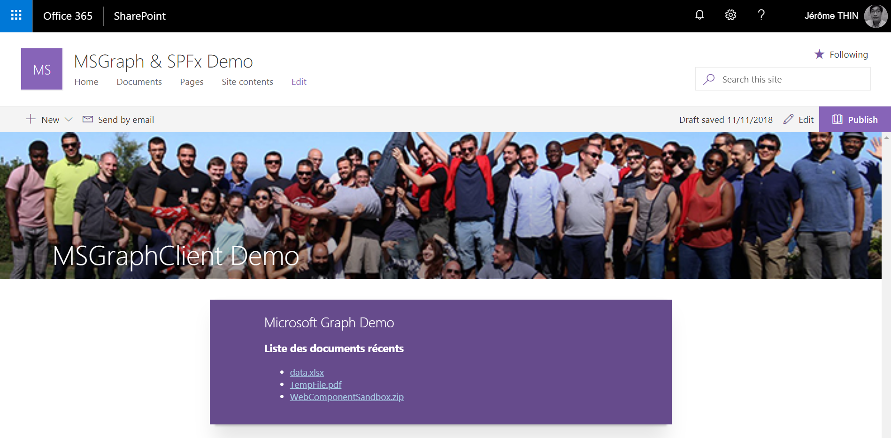

# ms-graph-client-demo
Ce projet montre comment interroger le Microsoft Graph à partir de la version 1.6 du SharePoint Framework (MsGraphClient et AadHttpClient).

Il vient compléter l'article du blog Cellenza sur SharePoint Framework et le Microsoft Graph.



## Instructions

### Prérequis
* [SharePoint Framework Dev environment](https://docs.microsoft.com/en-us/sharepoint/dev/spfx/set-up-your-developer-tenant)
* [Office 365 tenant](http://dev.office.com/sharepoint/docs/spfx/set-up-your-developer-tenant)

⚠ Le code ne fonctionne pas sur le SharePoint workbench local.

### Installation des dépendances
```bash
npm i
```

### Tester le code sur le workbench SharePoint

```bash
gulp serve --nobrowser
```
Ouvrir le Workbench SharePoint sur votre tenant Office 365.

Url du workbench : [url du site SharePoint]/_layouts/15/workbench.aspx

Ex : https://[nom_Tenant].sharepoint.com/sites/[nom_Site]/_layouts/15/workbench.aspx

### Déployer la solution sur votre tenant

```bash
gulp bundle --ship
gulp package-solution --ship
```
* Uploader le package dans l'app catalog du tenant (ou au niveau site collection)
* Approuver les scopes de permissions requis par le package (API Management dans l'administration SharePoint)
* Se rendre sur votre site SharePoint
* Ajouter l'application depuis le store
* Créer une page et ajouter la web part

## A propos du projet

### Solution

Solution|Auteur(s)
--------|---------
ms-graph-client-demo|Jérôme THIN ([Cellenza](https://github.com/Cellenza) - @JeromeThin)

### Historique de versions

Version|Date|Commentaires
-------|----|--------
1.0.0|11 Novembre 2018|Initial release

## Disclaimer
**THIS CODE IS PROVIDED *AS IS* WITHOUT WARRANTY OF ANY KIND, EITHER EXPRESS OR IMPLIED, INCLUDING ANY IMPLIED WARRANTIES OF FITNESS FOR A PARTICULAR PURPOSE, MERCHANTABILITY, OR NON-INFRINGEMENT.**