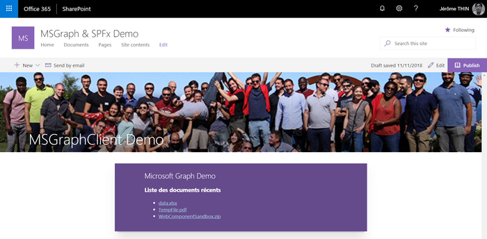

# spfx-msgraph-sample
Démo SPFx avec MSGraph (SPFx 1.6 et +)
* ms-graph-client-demo : version sans framework JavaScript avec AadHttpClient, MSGraphClient et aadTokenProvider
* react-msgraphclientdemo : version React avec MSGraphClient

Solution|Version|Auteur(s)
--------|---------|---------
ms-graph-client-demo|1.0|Jérôme THIN ([Cellenza](https://github.com/Cellenza) - @JeromeThin)
react-msgraphclientdemo|1.0|Jérôme THIN ([Cellenza](https://github.com/Cellenza) - @JeromeThin)